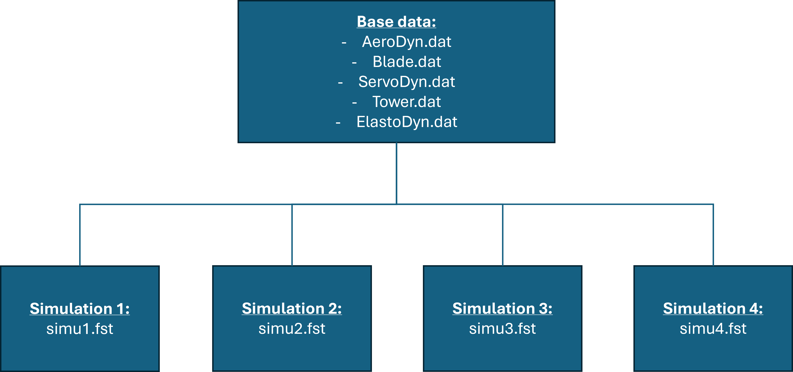

# Installing OpenFAST

## 1. Create the environment

Firstly, you can create the anaconda environment *"openfast_env"* by typing this command :

```conda
conda env create -f environment.yml
```

With the `environment.yml` file that contains:

- [openfast](https://openfast.readthedocs.io/en/main/source/this_doc.html)
- [matplotlib](https://matplotlib.org/stable/)
- [numpy](https://numpy.org/)
- [scikit-learn](https://scikit-learn.org/stable/index.html): for some machine learning
- [scipy](https://scipy.org/): for some statistics/fits
- [seaborn](https://seaborn.pydata.org/): for more plots
- [windrose](https://pypi.org/project/windrose/): to plot windroses
- [plotly](https://plotly.com/): to make interactive plots
- [pyarrow](https://arrow.apache.org/docs/python/index.html): to have some binary export formats(parquet)


## 2. Add the openFAST toolbox to the environment

The OpenFAST toolbox allows you to read the binary output files generated by the software.The toolbox is a [github repo](https://github.com/OpenFAST/openfast_toolbox) that you must clone and then, create a package based on it.

In the anaconda prompt you can type these commands:

```conda
conda activate openfast_env
git clone http://github.com/OpenFAST/openfast_toolbox
cd openfast_toolbox
python -m pip install -e .
```

## 3. Install TurbSim

In order the create non-uniform velocity profiles, you must install [TurbSim](https://www.nrel.gov/wind/nwtc/turbsim)


# Performing simulations with OpenFAST

An example of the working directory can be:



With a 'master' repo containing all the wind turbine informations (aerodynamic properties, mechnaical properties, airfoils characteristics, ...) and some 'slave' repositories which will contain the simulation informations in the .fst file such as wind profile, air characteristics, duration of the simulation, time steps, ...

To perform a simulation, you must be in one of the slave directories and type in the anaconda prompt console(you must replace the 'simu1.fst' by the name of your file)

```conda
conda activate openfast_env
openfast simu1.fst
```